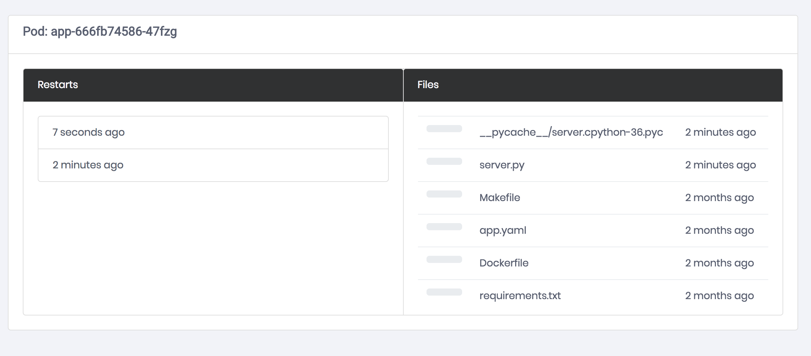

<br clear="all" />

------------
ksync speeds up developers who build applications for Kubernetes. It transparently updates containers running on the cluster from your local checkout. This enables developers to use their favorite IDEs, such as Atom or Sublime Text to work from inside a cluster instead of from outside it. There is no reason to wait minutes to test code changes when you can see the results in seconds.

If you've been wanting to do something like `docker run -v /foo:/bar` with Kubernetes, ksync is for you!

Using ksync is as simple as:

1. `ksync create --pod=my-pod local_directory remote_directory` to configure a folder you'd like to sync between your local system and a specific container running on the cluster.
1. `ksync watch` to connect to the cluster and start updating the container.
1. Use your favorite editor, like [Atom][atom] or [Sublime Text][st3] to modify the application. It will auto-reload for you remotely, in seconds.

# Demo

See it in action, below or try it out in your browser using this [Katacoda scenario][katacoda]:


# Installation

You can also download the [latest release][latest-release] and install it yourself.

### Linux/MacOSX

```bash
curl https://vapor-ware.github.io/gimme-that/gimme.sh | bash
```

### Windows

Download the [latest release][latest-release] and install it yourself.

### Source

Grab the source and build the binary.

```shell
go get github.com/vapor-ware/ksync/cmd/ksync
```

More detailed information is in the [development documentation](docs/development.md).

## Updating

To update to (or check for) a newer version of `ksync`, you can use the built in updater.

```shell
ksync update
```

Once a newer `ksync` binary has been downloaded, the cluster portion can be updated with `ksync init`.

```shell
ksync init --upgrade
```

You can check the current versions by running `ksync version`.

```shell
ksync version
```

# Prerequisites

- Kubernetes cluster. Take a look at the [docs][k8s-setup] for instructions on how to do it.

    A couple fast and easy solutions:

    - To keep it all local, check out [minikube][minikube].
    - If you'd like something remote, [GKE][GKE] can create a cluster fast.

- `kubectl` configured to talk to your cluster.

# Getting Started

You can run through this via. a [katacoda scenario][katacoda] in your browser as well.

1. Install ksync. This will fetch the binary and put it at `/usr/local/bin`. Feel free to just download the release binary for your platform and install it yourself.

    ```bash
    curl https://vapor-ware.github.io/gimme-that/gimme.sh | bash
    ```

1. Initialize ksync and install the server component on your cluster. The server component is a DaemonSet that provides access to each node's filesystem. This will also go through a set of pre and postflight checks to verify that everything is working correctly. You can run these yourself by using `ksync doctor`.

    ```bash
    ksync init
    ```

1. Startup the local client. It watches your local config to start new jobs and the kubernetes API to react when things change. This will just put it into the background. Feel free to run in a separate terminal or add as a service to your host.

    ```bash
    ksync watch &
    ```

1. Add the [demo app][demo-app] to your cluster. This is a simple python app made with flask. Because ksync moves files around, it would work for any kind of data you'd like to move between your local system and the cluster.

    ```bash
    kubectl apply -f https://vapor-ware.github.io/ksync/example/app/app.yaml
    ```

1. Make sure that the app is ready and running.

    ```bash
    kubectl get po --selector=app=app
    ```

1. Create a new spec that describes a folder to sync between a local directory and a directory inside a running container on the remote cluster. The local directory is empty and that is okay. Because ksync is bi-directional, it will move all the files from the running container locally. This is just a convenient way to get the code from the container and skip a couple steps. If you're working with a local copy already, only the most recently updated files will be transfered between the container and your local machine.

    ```bash
    mkdir -p $(pwd)/ksync
    ksync create --selector=app=app $(pwd)/ksync /code
    ```

1. Check on the status. You should see a `watching` state with a pod name in the list.

    ```bash
    ksync get
    ```

1. Forward the remote port to your local system.

    ```bash
    kubectl get po --selector=app=app -o=custom-columns=:metadata.name --no-headers | \
        xargs -IPOD kubectl port-forward POD 8080:80 &
    ```

1. Take a look at what the app's response is now. You'll see all the files in the remote container, their modification times and when the container was last restarted.

    ```bash
    curl localhost:8080
    ```

1. Open up the code in your favorite editor. For demo purposes, this assumes you've configured `EDITOR`. You really can open it however you'd like though.

    ```bash
    open ksync/server.py
    ```

1. Add a new key to the JSON response by editing the return value.

    ```python
    return jsonify({
        "ksync": True,
        "restart": LAST_RESTART,
        "pod": os.environ.get('POD_NAME'),
        "files": file_list,
    })
    ```

1. Take a look at the status now. It should be reloading the remote container.

    ```bash
    ksync get
    ```

1. After about 10 seconds, hit the container again and you should see your new response.

    ```bash
    curl localhost:8080
    ```

## Further Exploration

- Modify the number of replicas and see what happens.

    ```bash
    kubectl scale deployment/app --replicas=2
    ```

- Startup the [visualization][frontend] so you can see updates in real time. Save some files and change the replica count of app to see the updates.

    ```bash
    kubectl apply -f https://vapor-ware.github.io/ksync/example/frontend/frontend.yaml
    kubectl get po \
        --selector=app=frontend \
        -o=custom-columns=:metadata.name \
        --no-headers \
        | xargs -IPOD kubectl port-forward POD 8081:80 &
    python -mwebbrowser http://localhost:8081
    ```



# Tested Configurations

## Cluster

- Minikube
    - v0.23.*
    - v0.24.*
    - v0.25.*

- GKE
    - v1.7.*
    - v1.8.*
    - v1.9.*
    - v1.10.*

- Docker for Mac (Kubernetes)
    - 17.12-ce
    - 18.*-ce

## Docker

- Docker
    - 1.13.*
    - 17.*-ce
    - 18.*-ce

## Filesystem

- OverlayFS (overlay2)

# Troubleshooting

- Nothing is happening and `ksync get` says that it is `waiting`.

    This is the state where the cluster is being monitored and it doesn't look like there is anything to do. Make sure you're

- `ERROR Path ... does not exist on the server`

    There's likely something in your configuration that we're not able to handle yet.

- `client is newer than server (client API version: ..., server API version: ...)`

    You're using an older version of docker than we support.

- `The configured docker storage root (/dind/docker) on node <node> does not match the storage root specified: /var/lib/docker. Please check your remote storage root or pass the correct root in init with --docker-root.`

    You're using [Docker in Docker Kubernetes](https://github.com/kubernetes-sigs/kubeadm-dind-cluster) (or some other setup) which uses a different directory structure for it's root. You may follow the steps in [Issue #212](https://github.com/vapor-ware/ksync/issues/212) to specify a different root directory.

- `FATA[0000] rpc error: code = Unavailable desc = transport is closing`

    If you're using minikube with `vm-driver=none`, make sure that `socat` is installed on the host where minikube is running.

- `There is a mismatch between the local version (some version) and the cluster ()`

    This is caused by a transient error in our CI pipeline when builds are released with the same git tag (how version matching is done). You may specify the image to use with the remote DaemonSet via the `--image` flag. An example to solve this problem with version `0.4` would be the following:

    `ksync init --remote --image=vaporio/ksync:0.4.0`


# Documentation

More detailed documentation can be found in the [docs](docs) directory.

- [Architecture](docs/architecture.md)
- [Development](docs/development.md)
- [Releasing](docs/releasing.md)
- [Offline Usage](docs/offline.md)

[atom]: https://atom.io/
[st3]: https://www.sublimetext.com/
[latest-release]: https://github.com/vapor-ware/ksync/releases
[k8s-setup]: https://kubernetes.io/docs/setup/pick-right-solution/
[GKE]: https://cloud.google.com/kubernetes-engine/docs/quickstart
[minikube]: https://github.com/kubernetes/minikube
[demo-app]: https://vapor-ware.github.io/ksync/example/app/app.yaml
[frontend]: https://vapor-ware.github.io/ksync/example/frontend/frontend.yaml
[katacoda]: https://www.katacoda.com/vaporio/scenarios/ksync
