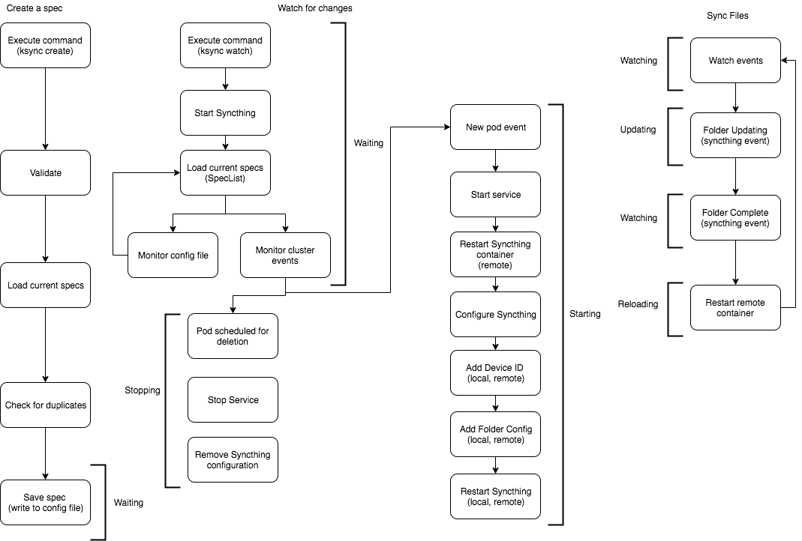

There are two major components to ksync, one that runs on your local system and another that operates on the remote cluster.

# Local

The local piece of ksync is operated via. the `ksync` binary. It provides some general functionality:

- Cluster setup and initialization.
- Configuration of folders to sync to the cluster.
- Operating the details of the actual folder syncing (setting up the connection, configuring the local and remote instances of syncthing to move the files, managing the local syncthing process).

## Commands

### Create/Delete

These commands read and write the config file (~/.ksync/ksync.yaml). When a new spec is created, it is added to the spec list and then serialized to disk.

```
apikey: ksync
context: ""
log-level: debug
namespace: default
port: 40322
spec:
- name: sunny-husky
  containername: ""
  pod: ""
  selector: app=app
  namespace: default
  localpath: /tmp/ksync
  remotepath: /code
  reload: true
```

Because these commands simply work on the config file, it is not a requirement that `watch` is running to add or remove specs.

### Get

The current status of folders is managed by watch. To fetch this, get connects to the small gRPC server started via. watch and gets the currently running SpecList. This contains everything required to show what is happening.

### Watch

This is the main workhorse of ksync. It does a couple things:

- Populates a SpecList that contains everything create has configured.
- Watches the config file (~/.ksync/ksync.yaml) for updates and modifies the SpecList accordingly.
- Starts up [syncthing][syncthing] in the background to manage the actual file syncing.
- Starts up a gRPC server to provide status to get.

## Config Directory

The configuration directory (~/.ksync) has the following format:

- ksync.yaml - The configuration file
- bin/syncthing - The specific syncthing binary fetched.
- syncthing - The "home" directory for syncthing. This contains its configuration and db among other things.

# Remote

There is a cluster component that compliments `ksync` running locally. It is a docker image that is run as a DaemonSet on every node in your cluster. The launched pods have two containers (via. the same docker image): radar and syncthing. The functionality provided by this piece is:

- Path discovery via. the docker daemon.
- Container restart for both syncthing and the "hot reloaded" container.
- The remote folder syncing component of syncthing.

## Radar

Remote containers run on specific nodes, the docker daemon running on these nodes needs to be inspected and instructed what to do. This provides the filesystem path that a specific container is running from (ex. /var/lib/docker/...). Radar operates as a convenient way for ksync to fetch that path before configuring a folder sync.

In addition to querying the docker daemon, radar also issues restart API requests for when the syncthing container or remote container need to be restarted.

## Syncthing

Ksync itself does not implement the file syncing between hosts. It simply orchestrates that. Syncthing does the actual moving of files.

# Lifecycle



# Internal implementation

From a syncing perspective, the most important objects (and their relationships) are:

    SpecList -> Spec(SpecDetails) -> ServiceList -> Service(RemoteContainer) -> Folder

## SpecList

The canonical list of specs (and thus folders) that contain the configuration required to move files between the local and remote systems.

- Deserializes the specs from config.
- Provides add/delette functionality.
- Watches the config file, updating what is currently live.

## Spec

Orchestration of a specifc spec and the folders that can be synced between the local and remote systems.

- Watches the k8s API for events that match the SpecDetails.
- Creates new services for matching remote pods.
- Cleans up existing services if the remote pods are deleted.

## SpecDetails

All configuration required to sync a folder.

## ServiceList

Each spec can match multiple pods (in the event that a selector is used instead of a pod name). The service list orchestrates each individual service.

- Creates new Services (containing RemoteContainers).
- Starts the services.
- Cleans the services up.

## Service

A service represents an active folder being synced.

## RemoteContainer

The remote side of a spec. Once a match has occurred, the RemoteContainer has all configuration required to contact and orchestrate the remote side of things.

## Folder

This is where the bulk of orchestration occurs.

- Creates a tunnel (and gRPC connection) to the radar instance running on the node from RemoteContainer.
- Restarts the *remote* syncthing container (to refresh mounts).
- Create a tunnel for both the syncthing API and normal syncing ports.
- Monitors events off the *local* syncthing process to hot reload if configured.
- Configures the device ids for the local and remote syncthing processes to allow them to connect to each other.
- Configures the folders in both the local and remote syncthing processes to start the actual sync.
- Updates status based off the *local* syncthing events.
- Cleans up all the tunnels, connections and configuration when the remote container goes away.

